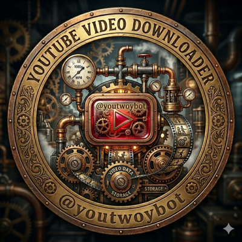

<div align="center">
  

  # Просто песня

  Telegram-бот для скачивания видео с YouTube.
  Пришлите ссылку — бот вернёт видео файлом прямо в чат.
</div>

---

## Что умеет

- Принимает ссылки на YouTube: обычные видео, Shorts, live и `youtu.be`.
- Скачивает видео и отправляет его обратно файлом в Telegram.
- Принудительно использует кодек H.264 (avc1) + AAC, чтобы видео гарантированно воспроизводилось во всех Telegram-клиентах.
- Ограничивает размер под лимит Telegram Bot API (50 МБ): подбирает качество с запасом.
- Опциональный whitelist пользователей по ID.

## Ограничения

- **50 МБ** — максимальный размер файла для отправки через публичный Telegram Bot API. Видео, которое не укладывается в лимит даже в пониженном качестве, бот отклонит с понятным сообщением.
- Бот скачивает в качестве до 720p (H.264), приоритет — уложиться в лимит.

## Архитектура

```
Telegram  ──webhook──▶  Serverless Container (Yandex Cloud)
                              │
                        aiogram 3.x (FastAPI ASGI)
                              │
                        yt-dlp + ffmpeg
                              │
                        видео файлом ──▶  Telegram
```

- **Yandex Serverless Container** — публичный HTTPS-эндпоинт, масштабируется до нуля. Telegram шлёт апдейты напрямую на webhook контейнера.
- **Защита webhook** — заголовок `X-Telegram-Bot-Api-Secret-Token` сверяется с секретом на каждом запросе.
- **Секреты** (`BOT_TOKEN`, `WEBHOOK_SECRET`) хранятся в **Yandex Lockbox** и инжектятся в контейнер при деплое — в коде и репозитории их нет.

## Стек

| Компонент | Назначение |
|---|---|
| Python 3.12 | Рантайм |
| aiogram 3.x | Telegram Bot framework (webhook) |
| FastAPI + uvicorn | ASGI-приёмник webhook |
| yt-dlp | Скачивание с YouTube |
| ffmpeg | Склейка видео+аудио, контейнер mp4 |

## Структура проекта

```
app/
  config.py       — переменные окружения (BOT_TOKEN, WEBHOOK_SECRET, лимиты, whitelist)
  downloader.py   — yt-dlp: выбор формата под лимит, скачивание во временную папку
  bot.py          — aiogram: /start, обработка ссылки, отправка видео
  main.py         — FastAPI: lifespan (set_webhook), POST /webhook, GET / (health)
terraform/        — инфраструктура как код (SA, IAM, Lockbox-биндинги, контейнер)
.github/workflows/deploy.yml — CI/CD: build → deploy → smoke-test → rollback
scripts/set-webhook.sh — регистрация webhook в Telegram (читает секреты из Lockbox)
Dockerfile        — python:3.12-slim + ffmpeg + yt-dlp
```

## Переменные окружения

| Переменная | Обязательна | Описание |
|---|---|---|
| `BOT_TOKEN` | да | Токен бота от @BotFather (из Lockbox) |
| `WEBHOOK_SECRET` | да | Секрет для проверки заголовка webhook (из Lockbox) |
| `BASE_WEBHOOK_URL` | нет | Если задан — webhook ставится автоматически при старте |
| `ALLOWED_USER_IDS` | нет | CSV из Telegram user ID; пусто = разрешено всем |

## Деплой

Инфраструктура описана в Terraform, выкатка — через GitHub Actions при push в `main`.

```bash
# Применить инфраструктуру (первый раз — с импортом существующих ресурсов)
cd terraform
bash import.sh          # адопция уже созданных ресурсов в state
terraform apply

# Дальше деплой автоматический: push в main с изменениями в app/, Dockerfile,
# requirements.txt или workflow запускает build → deploy → smoke-test.
```

CI-пайплайн: проверка синтаксиса → сборка и push образа (linux/amd64) → деплой новой ревизии контейнера → smoke-test (health-check) → автоматический rollback при провале.

## Ротация токена

Токен и webhook-секрет хранятся в Lockbox. Чтобы сменить токен:

```bash
yc lockbox secret add-version --id <SECRET_ID> --payload \
  '[{"key":"token","textValue":"НОВЫЙ_ТОКЕН"},{"key":"webhook-secret","textValue":"ТОТ_ЖЕ_СЕКРЕТ"}]'

# Передеплой ревизии (через CI или вручную) и переустановка webhook:
bash scripts/set-webhook.sh
```
